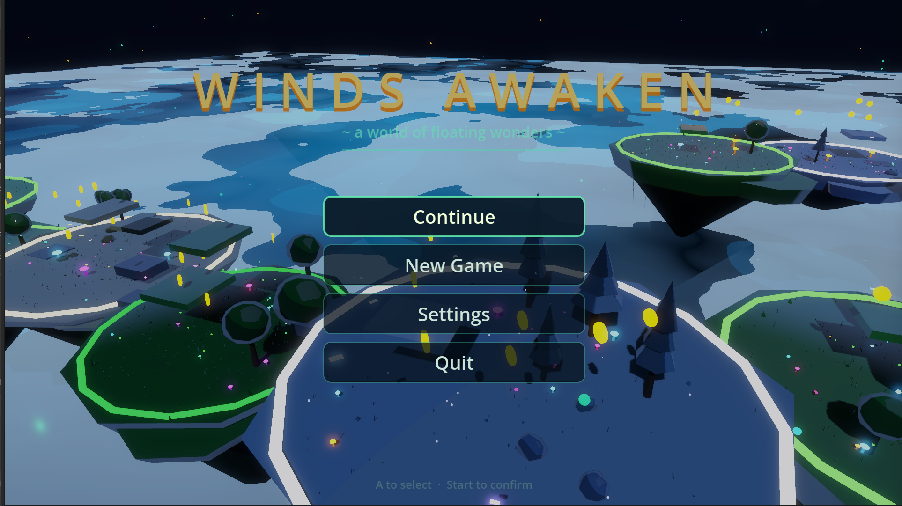
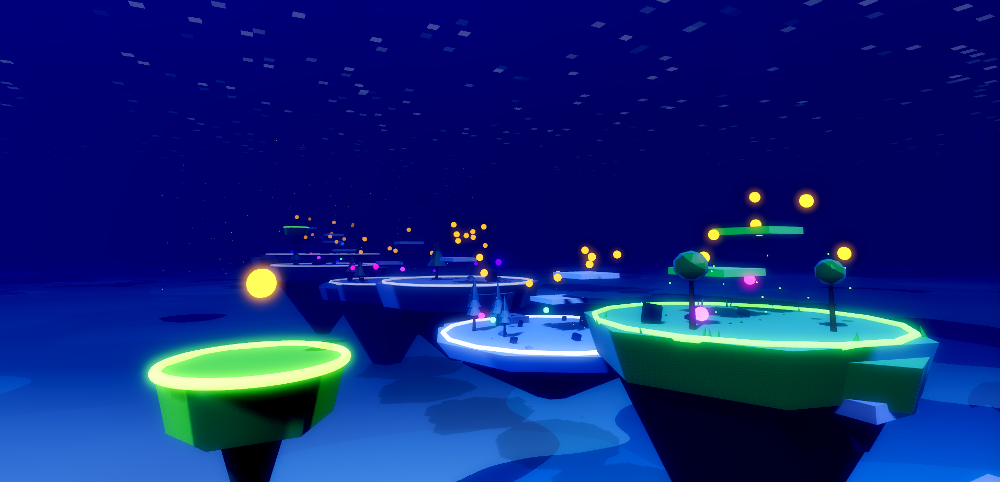
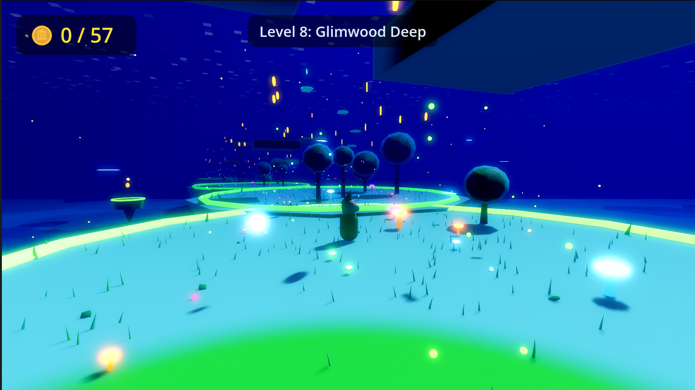
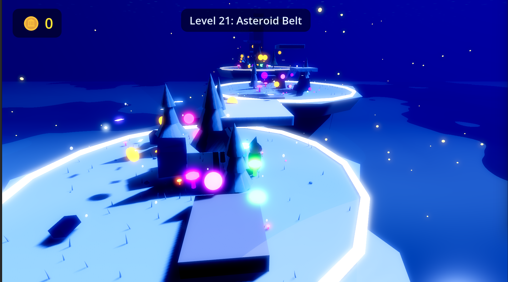

# 🌊 Winds Awaken

### **[▶ Visit the Official Website](https://ericdataplus.github.io/winds-awaken-site/)**

---

### *A Cel-Shaded Ocean Adventure*

**60 Floating Islands • 6 Breathtaking Biomes • Precision Platforming**

---

## 🎮 About the Game

**Winds Awaken** is a cel-shaded 3D platformer inspired by *The Wind Waker* and *A Short Hike*. Set sail across a vast ocean dotted with mystical floating islands — each one a unique platforming challenge filled with collectibles, hidden paths, and breathtaking scenery.

Master the winds, unlock the **Phase Shift** ability to transform into a wind spirit, and discover the secrets that bind these islands together.

### ✨ Key Features

- 🏔️ **Precision Platforming** — Double jumps, wall slides, wall jumps, dashes, and ground pounds
- 🌍 **6 Unique Biomes** — From tropical beaches to volcanic peaks, each with its own visual style
- 🗺️ **60 Handcrafted Levels** — Increasing complexity and beauty
- 💰 **Collectibles & Secrets** — Golden coins, jade, and three-star ratings for completionists
- 🎨 **Cel-Shaded Beauty** — Custom toon shaders, stylized water, aurora skies, and lava effects
- 🌬️ **Phase Shift** — Transform into a wind spirit and pass through walls to find hidden paths

---

## 🌎 Discover the Worlds

| World | Biome | Description |
|-------|-------|-------------|
| 01 | 🌴 **Tropical Beach** | Sun-kissed shores and coral reefs |
| 02 | 🌿 **Dense Jungle** | Towering trees and glowing mushrooms |
| 03 | ❄️ **Frostbite Peaks** | Crystal ice formations and auroras |
| 04 | 🏮 **Windfall Village** | A cozy settlement in the clouds |
| 05 | ⭐ **Cosmos Ocean** | Where sky and sea blur together |
| 06 | 🌋 **Inferno Peak** | Rivers of lava and crumbling platforms |

---

## 📸 Screenshots

*Floating islands stretch across the ocean*

*Explore the mystical Glimwood Deep*

*Navigate the frozen Asteroid Belt*

---

## 💰 Coming Soon — $5

- ✅ Full game — 60 levels, 6 biomes
- ✅ Windows, Mac & Linux builds
- ✅ DRM-free download  
- ✅ All future updates included
- ✅ Support an indie developer

**[🔔 Get notified at launch →](https://ericdataplus.github.io/winds-awaken-site/#newsletter)**

---

## 🛠️ Built With

- **[Godot Engine](https://godotengine.org/)** — Open-source game engine
- **Custom Toon Shaders** — Hand-crafted cel-shading pipeline
- **GitHub Pages** — Free static website hosting

---

**© 2026 Winds Awaken. All rights reserved.**

*Made with 💚 and Godot Engine*

**[Privacy Policy](https://ericdataplus.github.io/winds-awaken-site/privacy.html)** • **[Terms & EULA](https://ericdataplus.github.io/winds-awaken-site/terms.html)** • **[Refund Policy](https://ericdataplus.github.io/winds-awaken-site/refund.html)**

